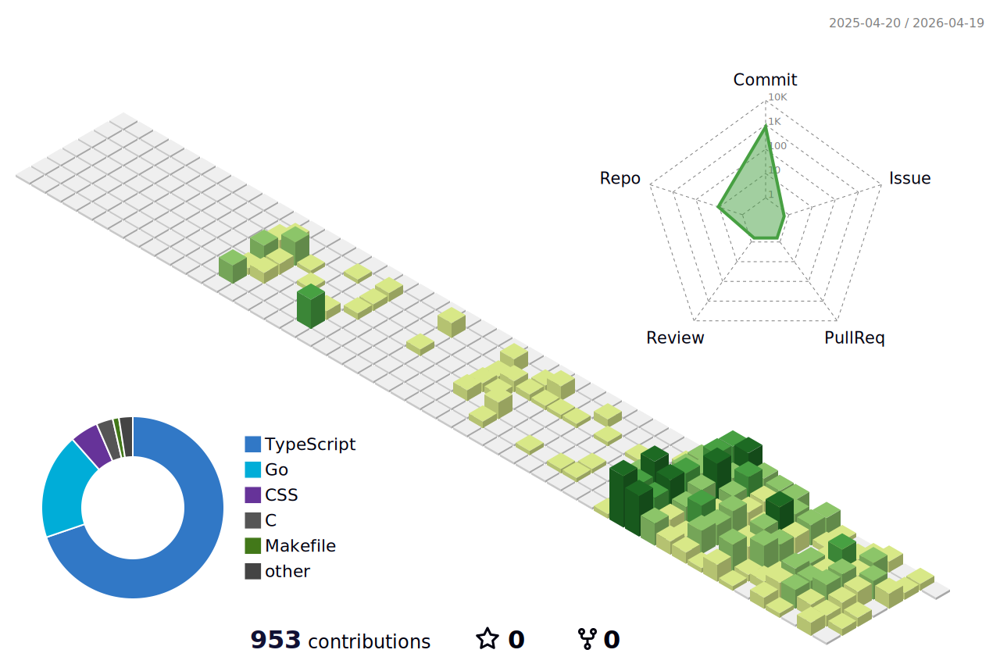

  

   

  

    <b>关于我</b>
      
    <b>作为一名专注于 Golang 开发的软件工程师，我热衷于探索和分享技术。 这里记录着我的技术成长与思考，如果这些内容对你有所启发，欢迎关注与交流！</b>
  

   

  <!-- 3D Contribution Graph -->
  <picture>
    <source media="(prefers-color-scheme: dark)" srcset="profile-3d-contrib/profile-night-rainbow.svg">
    <source media="(prefers-color-scheme: light)" srcset="profile-3d-contrib/profile-green.svg">
    
  </picture>

   

  

    
    
  

   

  

    <b>我的朋友们</b>
      
    

      
      &nbsp;&nbsp;
      
    

  

